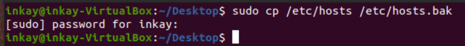
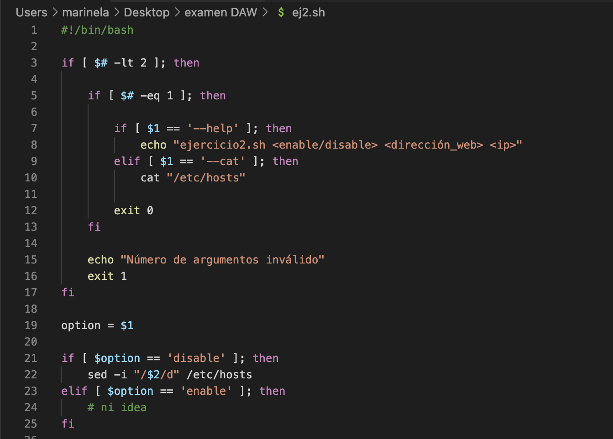

# **Ejercicio2**

[Marinela Mihaylova](https://github.com/intkai)

## **Resumen**

Markdown acerca del ejercicio dos del examen de la primera evaluación de la asignatura de despliegue de aplicaciónes web. Este ejercicio se ha basado en el tema dos y en el bash scripting. Hemos intentado modificar el contenido del archivo /etc/hosts.

## **Índice**

- [**Ejercicio2**](#ejercicio2)
  - [**Resumen**](#resumen)
  - [**Índice**](#índice)
  - [**Introducción**](#introducción)
  - [**Realización. Paso a Paso**](#realización-paso-a-paso)
  - [**Conclusión**](#conclusión)
  - [**Bibliografía**](#bibliografía)

## **Introducción**

Algunas de las mayores dificultades en con las que nos hemos encontrado en este ejercicio (al menos en lo personal) es que no he estudiado bash scripting tan a fondo como otros temas de la asignatura. Este ejercicio ha conllevado más dificultades que satisfacción por haber logrado algo.

## **Realización. Paso a Paso**

En Primer lugar he creado una copia de seguridad del archivo **_etc/hosts._** Presuponemos pues, que hay una alta probabilidad de romperlo todo y quedarnos así sin acceso a internet.

Una vez creada nuestra copia de seguridad podemos proceder a programar nuestro **script**.

## **Conclusión**

Debido a algunos inconvenientes e inconsistencias se ha quedado un poco a la mitad.

## **Bibliografía**

CLASSROOM Despliegue de aplicaciones web.
